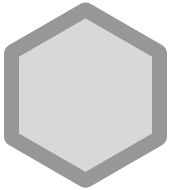

# Pinax Design

This repo houses all the design artifacts for Pinax, starting with the creation
of individual project badges.

## Badges

Each badge is a hexagon with a thick border and a representative icon.

### Blank Badge

### django-mailer

### django-user-accounts

### pinax-announcements

### pinax-badges

### pinax-blog

### pinax-calendars

### pinax-comments

### pinax-documents

### pinax-forums

### pinax-images

### pinax-likes

### pinax-messages

### pinax-news

### pinax-notifications

### pinax-phone-confirmation

### pinax-points

### pinax-ratings

### pinax-referrals

### pinax-stripe

### pinax-teams

